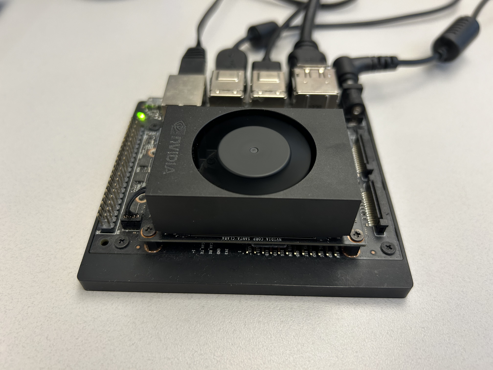
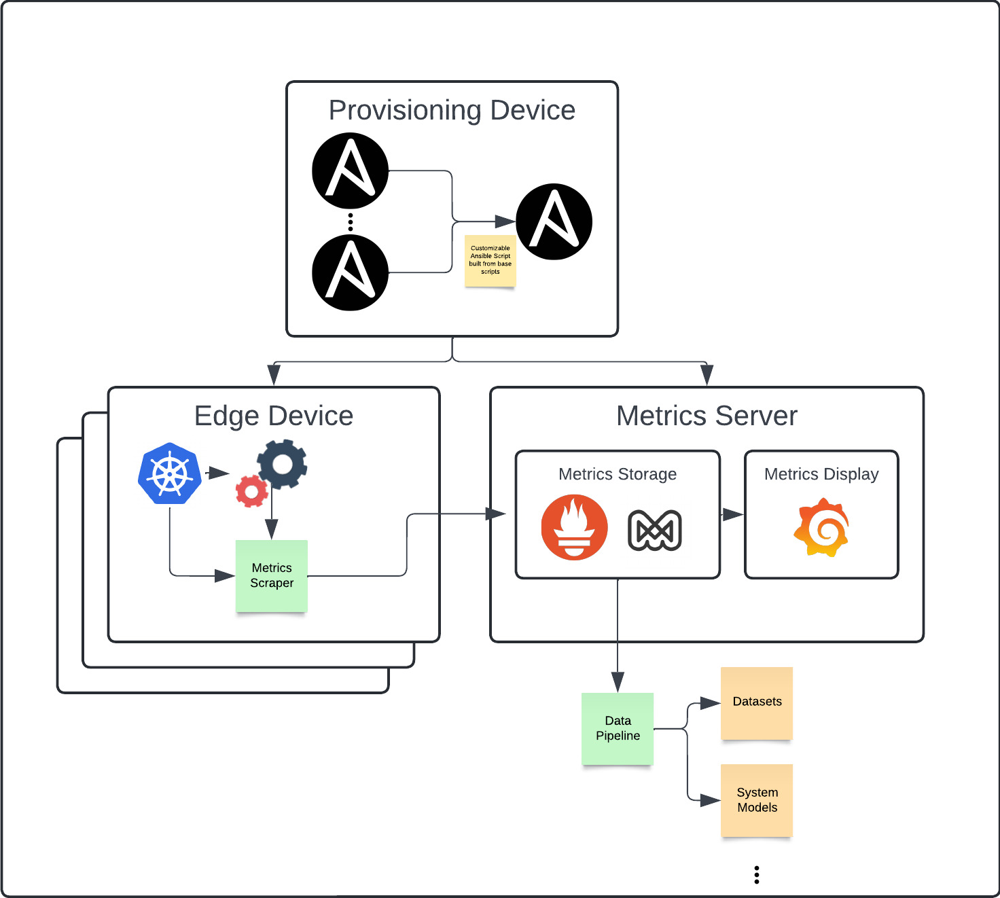
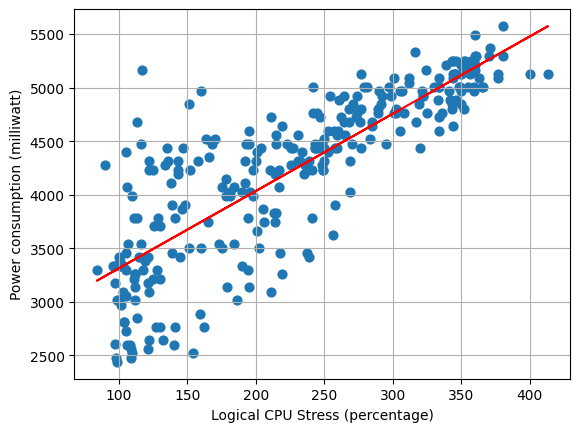
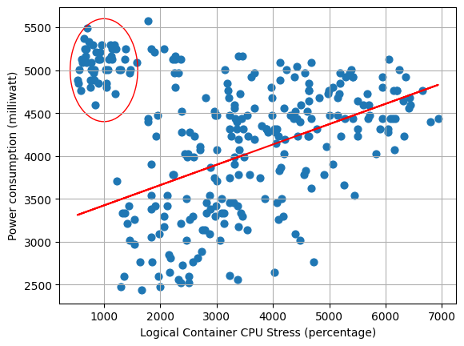
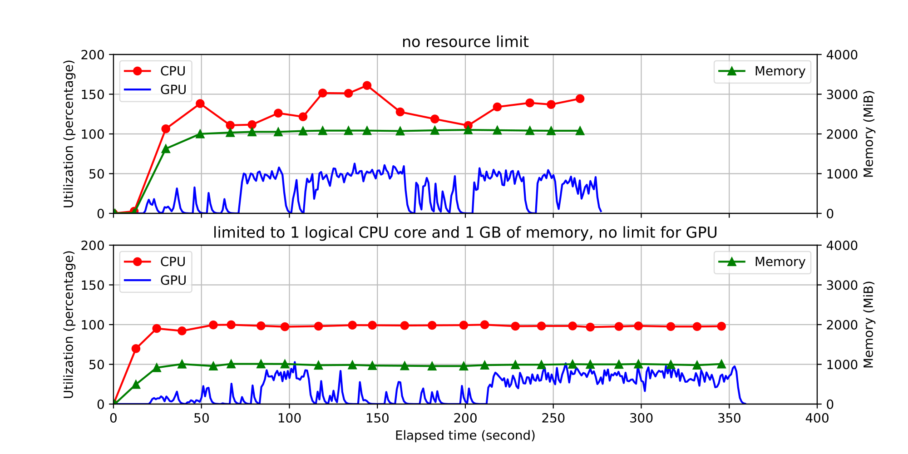

# Abstract 
Waggle is a state-of-the-art open-source platform for developing and deploying novel artificial intelligence algorithms and new sensors into distributed sensor networks. This platform has allowed for researchers to make scientific advancements in diverse environments. Despite its success and technological sophistication, Waggle has its shortcomings. For example, the current Waggle infrastructure has no notion of resource management. Instead, it attempts to use resources conservatively–directly impacting the performance of individual nodes. 

*Wild Waggle Nodes*

To better understand resource usage within the Waggle infrastructure, we are proposing a standard set of key metrics for resource utilization, designing a standardized system that mimics the Waggle nodes, developing a data collection pipeline, establishing an edge-specific resource utilization dataset, and building tools to analyze this dataset. In alignment with Waggle’s mission, we hope to open the door for other computer scientists to make contributions to resource management at the edge. Ultimately, our work will allow for more efficient computing at the edge through the Waggle infrastructure.

# Background and Motivation
Most estimates place the number of edge computing devices in the tens of billions, and this is only expected to grow. With single purpose edge devices, resource utilization is understood at the time of design. However, in general purpose systems such as Waggle, resource utilization is an open problem. A better understanding of resource utilization can allow for smarter job scheduling, smarter interactions with cloud and peer devices, and create more performant systems. While these contributions are small at the scale of a single device, they add up at the scale of the edge.

*An NVIDIA Jetson NX, the compute inside a Waggle node*

The necessity of resource management can be seen in the use of AI applications via Waggle. Summer student Ryan Rearden ran two recent multi-modal models that captioned a video clip. These models used nearly one hundred percent of the CPU for nearly ten hours each. With the growth of modern models, the necessity of real-time resource management is a must for general purpose AI edge systems like Waggle.

# A look at the Framework
To properly understand resource utilization, we first need to understand what our goal is. We chose power as our key metric to consider due to the power limitations and controls that exist within the Waggle ecosystem. On top of this, we identified CPU and GPU metrics as key contributors to power metrics. Therefore, when designing our system, we are focused on power, CPU, and GPU metrics. We highlighted power utilization, container level cpu utilization, system level cpu utilization, cpu frequency, system level gpu utilization, and gpu frequency as key metrics.

Now that we have identified our key metrics, we want to think about how we will develop a framework to obtain, store, display, and analyze them. First and foremost, we want this framework to be reproducible, flexible, and reliable. So, with that in mind, we want to take advantage of existing tools in building our framework. For provisioning devices, we use a customizable ansible script that provisions both edge devices and a metrics server. Note that these can be the same device if desired. For gathering metrics, we use Google’s CAdvisor, which collects container level metrics, and Waggle’s Jetson Exporter, which parses NVIDIA’s tegrastats tool for system level metrics. For storing metrics, we use Grafana’s Mimir, which is a time series metrics database. And finally, for displaying metrics, we use Grafana.
	
Since these are existing tools, we can implement the framework using the customizable ansible script that was mentioned earlier. Within this ansible script, we set up kubernetes to manage all running objects. Then, on the edge devices, we set up metrics gathering tools such as CAdvisor and Jetson Exporter. On the metrics server we set up metrics storage and display objects like Mimir and Grafana. All of this is managed through a set of kubernetes objects within its own namespace. 

To break down the ansible script into a flexible manner as we have mentioned, we highlight four key subprocesses that can be enabled on command. This is placed on top of a reusable base of kubernetes and other useful tools. We identify these four key areas as gathering metrics, storing metrics, display metrics, and using an NVIDIA graphics card. This level of control allows for multiple setups when gathering metrics. The most common in our use cases is combining gathering metrics with the use of an NVIDIA graphics card on our edge devices with storing and displaying metrics on our metrics server.

The final part of our framework is a simple and flexible data pipeline that allows users to pull data from our metrics server. Since our metrics server is in the prometheus format, it is possible to use any prometheus client as a data pipeline or write your own.

*The Framework*

# Gathering Data
Once we have developed our framework, we want to think about gathering data. Remember that one of our goals is to develop an edge computing dataset. With that in mind, we want to gather data from existing SAGE applications. These can fairly easily be run on the Waggle infrastructure and on our testbed that mimics it. That being said, there are a limited number of SAGE applications and they mostly focus on sensor data processing. To get a more holistic dataset, we can also simulate a program to collect the data that we need.

In order to simulate a program, we first need to think about what a program is in theory. We can think about a program as a black box. Within the problem space of metrics gathering, we can think about this program as a time-series set of resources usages Ri where each set corresponds to a time ti. Now, to represent any program, we let this set of resources R vary within the space of available resources. Finally, to simulate all possible programs, we can vary the length of ti and the set Ri randomly. As we do this to a greater degree, we are closer to simulating all possible programs. However, since this is not possible, it suffices to randomize our data to choose uniformly from this set.

To simulate a program, we use existing stress tools to vary the load on the system. The first tool is stressng, a tool for stressing cpu. The second tool is gpu-stress-test, a Waggle tool for stressing gpu. By combining them together with a controller that manages resources, we create a new program that enacts variable stress on the system. We chose these two programs because we identified CPU and GPU as key metrics for power utilization. In the future, adding more avenues of stress is as simple as incorporating them into the resource controller.

*Two plots gathered from simulating a program*

Now the other part of our dataset is built of SAGE applications themselves. Since we have designed our system with a black box program in mind, it is fairly straightforward to gather data from SAGE applications. All that is required are a few pieces of Waggle infrastructure and we can run SAGE applications on our test bed. Once we have these, we are able to run SAGE applications and profile their resource utilization based on the key metrics we identified earlier.

*Data gathered from monitoring a SAGE application*

Finally, the last way that we want to add variation in our dataset is through gathering data on multiple devices. The Waggle stack contains several different computation devices–including Raspberry Pis, NVIDIA Jetson NXs, and NVIDIA Jetson Nanos. To account for all of these while we gather data, it is important to apply our data gathering techniques across a variety of devices. Furthermore, the Waggle infrastructure is designed to be distributed. By gathering data from multiple devices, we can simulate a distributed network. Ultimately, making our testbed and data gathering sources simulate the Waggle ecosystem will give us the best dataset possible.

# Future Directions
Despite our progress, we are far from answering the question: “How do we save energy at the edge?” In short, our work is the foundation for future work. I’d like to highlight two main avenues that this work should take. 

First, it is important to answer that question that was posed above. We have started work with a group of optimization researchers at Northwestern University to work on control of the Waggle system. Through smarter scheduling, real time control of edge computing devices, and analysis of SAGE applications, we should be able to save energy at the edge. Providing an edge computing dataset is the first step to implementing all of these solutions. 

Second, it is important for the Waggle infrastructure to develop a testing environment. During the course of my internship a SAGE migration halted almost all work for over a week. At this time, the entire SAGE/Waggle team was struggling to make progress on their work. Without physical access to the Waggle nodes, there was no environment for people to test their work. As with most infrastructures, it is important to have a testing environment for people to start their work in. Our work this summer has started the process of developing a Waggle test environment. With further development on our testbed, we would be able to simulate a Waggle node for testing purposes.

# Acknowledgements
I would like to give thanks to Yongho Kim for his work as my mentor. He has been incredibly supportive and encouraging as I have completed my internship. I would also like to thank Andrew Siegel for pointing me in the direction of the SULI internship. Finally, I would like to thank all of the Waggle/SAGE team for all of their ideas and support throughout the summer.

# References
Argonne National Laboratory, Sage Continuum, https://sagecontinuum.org/	

Argonne National Laboratory, Waggle AI, https://wa8.gl/

